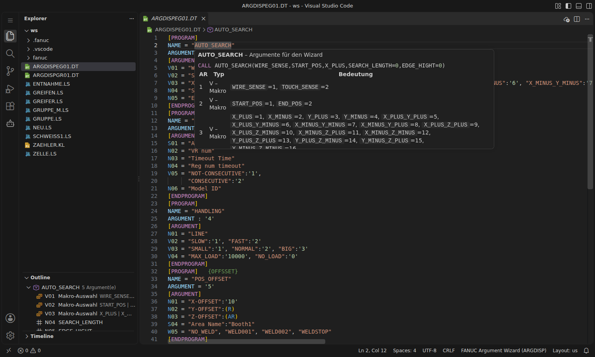

# Argument-Wizard (ARGDISP-Dateien)

Mit **„Wizard to input arguments“** zeigt das Teach Pendant beim `CALL` statt nackter Zahlen die Bedeutung jedes Arguments. Für Auswahlwerte gibt es Menüs:

```
1: CALL TRACKING('CStn_Out_R1',2,(-1),1,1,1)                         ohne Wizard
1: CALL TRACKING(Area Name='CStn_Out_R1',VR num=2,Timeout Time=(-1),
 : Reg num timeout=1,NOT-CONSECUTIVE,Model ID=1)                      mit Wizard
```

Die Beschreibung steht in einer Textdatei `ARGDISP<Sprache><Nr>.DT`. Die Extension unterstützt diese Dateien vollständig. Grundlage ist das FANUC-Handbuch *MAROUHT9307191E, Kap. 7.9.5*.



## Dateiformat

```
[PROGRAM]          {Kommentare in geschweiften Klammern}
NAME = "TRACKING"
ARGUMENT = '6'
[ARGUMENT]
S01 = "Area Name"
N02 = "VR num"
N03 = "Timeout Time":'10'
N04 = "Reg num timeout":(R)
V05 = "NOT-CONSECUTIVE":'1',
      "CONSECUTIVE":'2'
W06 = "NO_WELD", "WELD001", "WELD002"
[ENDPROGRAM]
```

| Element | Bedeutung | Grenzen |
|---|---|---|
| `NAME` | aufgerufenes Programm | max. 36 Zeichen |
| `ARGUMENT` | Anzahl der Argumente | max. 30 |
| `Nxx = "Bedeutung"` | Zahl; am TP wählbar: Konstante, `R[ ]`, `AR[ ]` | xx = 01–30, Bedeutung max. 15 Zeichen |
| `Nxx = "…":'10'` | mit Vorgabewert (Ganzzahl ±16777216 oder Dezimalzahl mit 6 signifikanten Stellen), auch `:(R)` / `:(AR)` | |
| `Sxx = "Bedeutung"` | Zeichenkette; am TP: String, `SR[ ]`, `AR[ ]`. Vorgabe `:"Text"`, `:(SR)`, `:(AR)` | |
| `Vxx = "NAME":'1', …` | Makro-Auswahl: angezeigt wird der Name, übergeben die Zahl | max. 35 Einträge, Namen max. 15 Zeichen, nur Ganzzahlen, Name und Wert eindeutig |
| `Wxx = "TEXT1", …` | String-Auswahl: der Text wird übergeben | max. 35 Einträge, je max. 34 Zeichen (im Menü 15 sichtbar) |
| `{ … }` | Kommentar | |

In Texten sind `,` `;` `:` `'` `"` und Tabulatoren nicht erlaubt. Eine Datei enthält höchstens 1000 Programme. Nach dem letzten `[ENDPROGRAM]` darf nichts mehr stehen.

**Dateiname:** `ARGDISP` + Sprache + Nummer 01–99 + `.DT`, z. B. `ARGDISPEG01.DT`. Sprachen: `EG` Englisch, `KN` Japanisch, `GR` Deutsch, `FR` Französisch, `SP` Spanisch, `CH` Chinesisch, `TW` Taiwanesisch, `CS` Tschechisch, `OT` Andere. Gelesen wird nur die Datei in der eingestellten Sprache der Steuerung.

## Funktionen in VS Code

- **Erkennung:** Dateien `ARGDISP*.DT` (oder Dateien, die mit `[PROGRAM]` beginnen) werden als **FANUC Argument Wizard (ARGDISP)** geöffnet.
- **Syntaxhighlighting:** Abschnitte, Schlüssel, Argumenttypen N/S/V/W, Texte, Werte, Register-Vorgaben, Kommentare.
- **Syntaxprüfung** nach den Regeln des Handbuchs. Wo möglich mit dem **Alarm, den die Steuerung beim Laden melden würde** (`FILE-096` bis `FILE-102`):
  - `PROGRAM = "…"` statt `NAME = "…"` (dann ignoriert der Wizard den Block)
  - fehlende oder doppelte Abschnitte, `[ENDPROGRAM]` fehlt, Inhalt nach dem Ende
  - unbekannte Schlüssel, doppelte Argumentnummern, Nummern außerhalb 01–30
  - Längen, verbotene Zeichen, Wertebereiche, Dezimalzahlen in Makros, doppelte Makronamen/-werte, mehr als 35 Einträge
  - `ARGUMENT` passt nicht zu den beschriebenen Argumenten, Lücken in der Nummerierung
  - ungültiger Dateiname
- **Quick Fixes:** `PROGRAM` → `NAME`, `ARGUMENT` korrigieren, `[ENDPROGRAM]` einfügen.
- **Outline** mit Programmen und Argumenten.
- **Hover** über einem Programm: **Vorschau, wie der CALL am Teach Pendant aussieht**, plus Argumenttabelle. Hover über `N01`/`V03` …: Erklärung des Typs.
- **Snippets:** `program`, `n`, `nd` (mit Vorgabe), `nr` (Vorgabe R/AR), `s`, `sd`, `sr`, `v`, `v3`, `vyes`, `vlr`, `w`, `comment`.

## Zusammenspiel mit den TP-Programmen

- **Hover auf `CALL PROG`** in einer `.ls`-Datei zeigt die Beschreibung aus der ARGDISP-Datei.
- **Prüfung der Aufrufe:** zu viele Argumente, Werte, die in einer V- oder W-Liste nicht vorkommen, Typ falsch (Zahl/Text). Beide LS-Schreibweisen werden verstanden: `CALL HANDLING(3,1,3,0)` und die Form, die die Steuerung bei aktivem Wizard speichert: `CALL HANDLING("LINE"=3,"SLOW"=1,"BIG"=3,"NO_LOAD"=0)`. Abschaltbar über `fanucLs.validation.checkCallArguments`.
- **Block aus einem Programm erzeugen:** Im TP-Programm Rechtsklick → **FANUC: Positionen & Achsen → Argumente für den Wizard beschreiben**. Die Extension sucht alle verwendeten `AR[n]` und legt in einer ARGDISP-Datei (vorhanden oder neu) einen Block mit `N01 …` an. Die Bedeutungen sind Platzhalter zum Überschreiben (Tab springt weiter).
- **Neue Datei:** **FANUC: Neue ARGDISP-Datei anlegen** fragt Sprache und Nummer ab.

## Auf die Steuerung bringen

1. Datei nach `MC:` übertragen (Wolken-Button in der Editor-Titelleiste oder Controller-Ansicht).
2. Am Teach Pendant im Dateimenü auf die Datei → **F3 [LOAD]**.
3. **Steuerung neu starten.**

Ist die Datei fehlerhaft, meldet die Steuerung z. B. `FILE-095 (ARGDISPEG01.DT) is not loaded` und im Alarmverlauf die Ursache (`FILE-096 on line n` …). Die Syntaxprüfung der Extension findet diese Fehler schon vorher.

Der Wizard wird über `$ARGDISPMODE` gesteuert: `0` aus, `1` ein (Standard), `2` ein und zusätzlich mit Anzeige der Makrowerte. Änderungen wirken nach einem Neustart. Mit aktivem Wizard gespeicherte LS-Dateien enthalten die Bedeutungen in Anführungszeichen; beim ASCII-Upload werden sie ignoriert (ab Softwarestand 7DC3/V8.30).
