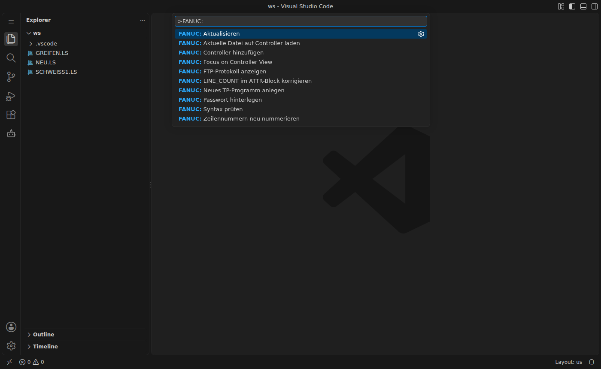

# Befehle

Alle Befehle sind über die Befehlspalette (`F1` oder `Strg+Umschalt+P`) mit dem Präfix **FANUC:** erreichbar:

| Befehl | Wirkung |
|---|---|
| FANUC: Neues TP-Programm anlegen | fragt den Namen ab und öffnet ein neues, ungespeichertes Listing |
| FANUC: Syntax prüfen | startet die Prüfung für die aktuelle Datei |
| FANUC: Zeilennummern neu nummerieren | nummeriert `/MN` durch, aktualisiert `LINE_COUNT` und `MODIFIED` |
| FANUC: LINE_COUNT im ATTR-Block korrigieren | setzt nur `LINE_COUNT` |
| FANUC: Controller hinzufügen | Assistent für eine neue Steuerung |
| FANUC: Passwort hinterlegen | FTP-Passwort im SecretStorage speichern |
| FANUC: Aktualisieren | Controller-Ansicht neu laden |
| FANUC: Aktuelle Datei auf Controller laden | Upload der offenen Datei |
| FANUC: FTP-Protokoll anzeigen | Ausgabekanal *FANUC FTP* öffnen |

Weitere Befehle stehen nur im Kontextmenü der Controller-Ansicht zur Verfügung, siehe [[Controller und FTP]].
