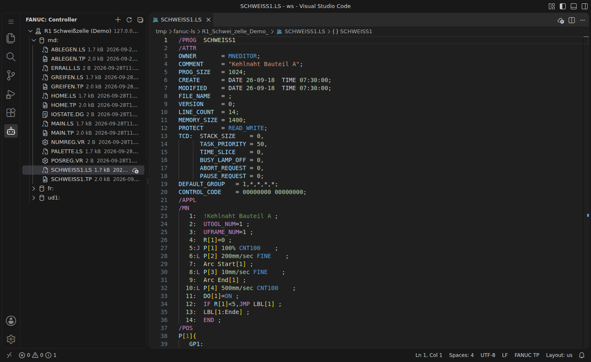
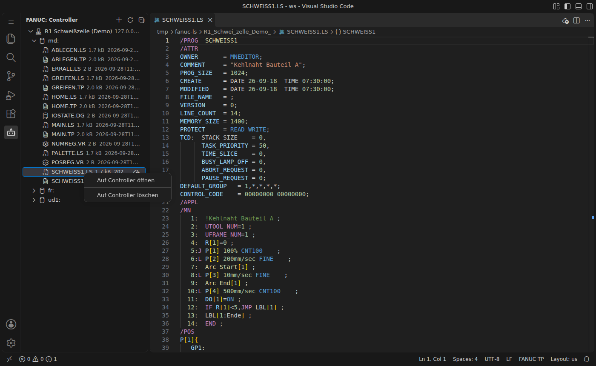

# Controller und FTP

Über das **Roboter-Symbol** in der Activity Bar öffnet sich die Controller-Ansicht mit dem Baum **Controller → Gerät (`md:`, `fr:`, `ud1:` …) → Dateien**.



> Die Screenshots auf dieser Seite wurden mit einem simulierten FTP-Server aufgenommen, nicht mit einer echten Steuerung. Die Dateiliste einer echten Steuerung sieht entsprechend aus, ist aber meist deutlich länger.

## Controller einrichten

1. In der Controller-Ansicht auf **+** (*Controller hinzufügen*) klicken.
2. Nacheinander eingeben: Anzeigename, IP-Adresse, FTP-Port (Standard 21), Benutzer (meist `anonymous`) und die Geräte (kommagetrennt, z. B. `md:,fr:,ud1:`).
3. Zum Schluss wird ein Passwort abgefragt. Leer lassen, wenn die Steuerung keines braucht. Ein eingegebenes Passwort wird verschlüsselt im **SecretStorage** von VS Code abgelegt, nicht in `settings.json`. Ändern lässt es sich später per Rechtsklick → **Passwort hinterlegen**.

Die Controller stehen danach in `fanucLs.controllers` und lassen sich auch direkt in `settings.json` pflegen:

```jsonc
"fanucLs.controllers": [
  { "name": "R1 Schweißzelle", "host": "192.168.0.10", "port": 21,
    "user": "anonymous", "devices": ["md:", "fr:", "ud1:"] }
]
```

Rechtsklick auf einen Controller: **Controller bearbeiten**, **Passwort hinterlegen**, **Controller entfernen**.

## Dateien übertragen



| Aktion | Wo | Wirkung |
|---|---|---|
| Öffnen | Klick auf eine Datei | lädt in ein temporäres Verzeichnis und öffnet im Editor |
| Herunterladen | Wolken-Symbol an der Datei | legt die Datei im Workspace ab (Standard: Ordner `fanuc/`) |
| Ganzes Gerät sichern | Rechtsklick auf Gerät/Ordner | lädt alle Dateien eines Geräts herunter, praktisch als Schnellsicherung vor Änderungen |
| Datei hierher laden | Wolken-Symbol am Gerät | lädt eine lokale Datei auf dieses Gerät |
| Aktuelle Datei hochladen | Wolken-Button in der Editor-Titelleiste, Rechtsklick im Editor oder Explorer | lädt die offene `.ls`-Datei auf die Steuerung |
| Auf Controller löschen | Rechtsklick auf Datei | löscht nach Rückfrage |
| Mit Controller vergleichen | Diff-Button in der Editor-Titelleiste, Rechtsklick im Editor oder Explorer | zeigt die Unterschiede zwischen lokaler Datei und Steuerung im Diff-Editor |
| Mit lokaler Datei vergleichen | Rechtsklick auf eine Datei in der Controller-Ansicht | sucht die lokale Kopie (Herkunft, gleichnamige Datei im Workspace oder Auswahl) und zeigt die Unterschiede |

Details:
- Die **Herkunft** heruntergeladener Dateien wird gemerkt. Beim Hochladen wird der ursprüngliche Pfad als Ziel vorgeschlagen.
- Beim **Vergleichen** wird die Datei der Steuerung in ein temporäres Verzeichnis geladen und links angezeigt, die lokale Datei rechts. Sind beide gleich (Zeilenenden werden ignoriert), erscheint nur eine Meldung.
- **Vor dem Upload** läuft die Syntaxprüfung (`fanucLs.ftp.validateBeforeUpload`). Bei Fehlern kommt eine Rückfrage. Vor dem Überschreiben wird ebenfalls nachgefragt (`fanucLs.ftp.confirmUpload`).
- Pro Steuerung wird **nur eine FTP-Verbindung gleichzeitig** geöffnet, weil FANUC-Steuerungen nur sehr wenige Sitzungen zulassen.

## Fehlersuche

- `fanucLs.ftp.verbose` einschalten und **FANUC: FTP-Protokoll anzeigen** aufrufen. Dort steht die komplette FTP-Kommunikation.
- Timeout erhöhen: `fanucLs.ftp.timeout` (Standard 8000 ms).
- Hängt die Verbindung: auf der Steuerung unter `MENU → SETUP → Host Comm → FTP` den FTP-Server neu starten.
- Weitere Hinweise unter [[Praxishinweise]].
