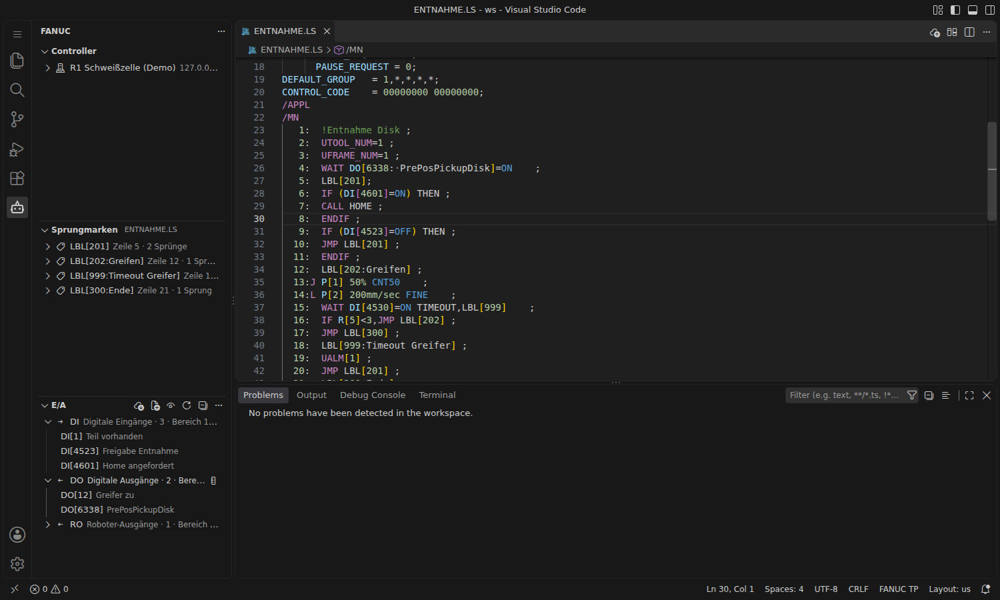

# Ein- und Ausgänge (E/A)

Die Extension sammelt Kommentare zu den Signalen (`DI`, `DO`, `RI`, `RO`, `GI`, `GO`, `AI`, `AO`, `UI`, `UO`, `SI`, `SO`, `F`, `M` …). Sie zeigt sie im Editor an und nutzt sie bei der Syntaxprüfung.



## Woher die Kommentare kommen

1. **Aus den Programmen im Workspace:** Referenzen mit Kommentar wie `DO[12:Greifer zu]` oder `DO[6338:ON :PrePosPickupDisk]` werden automatisch eingelesen.
2. **Vom Controller:** In der Ansicht **E/A** auf das Wolken-Symbol klicken (oder Rechtsklick auf einen Controller → **E/A-Liste vom Controller importieren**) und eine Datei wählen, empfohlen `md:IOSTATE.DG`. Die Extension liest daraus Typ, Nummer und Kommentar. **Der aktuelle Signalzustand (ON/OFF, Werte) wird nicht übernommen.**
3. **Aus einer CSV-Datei:** Datei-Symbol in der Ansicht E/A. Format je Zeile `Typ;Nummer;Kommentar` (auch mit `,` oder Tab getrennt, oder `DO[12];Kommentar`); eine Kopfzeile wird übersprungen.

Importierte Listen liegen als JSON unter `.fanuc/io/<Controller>.json` im Workspace und können mit eingecheckt werden. Über `…` → **E/A-Liste als CSV exportieren** lässt sich alles gesammelt, z. B. für Excel, ausgeben.

## Im Editor

- **Hover** über einem Signal zeigt Typ, Kommentar, Quelle und ggf. den im Text gespeicherten Status.
- **Vervollständigung** nach `DO[` schlägt die bekannten Nummern mit Kommentar vor; die Suche findet auch über den Kommentar (z. B. `DO[greif`).
- Ein Klick auf ein Signal in der Ansicht **E/A** sucht alle Verwendungen in den Programmen.

## Status ausblenden

Vom Controller exportierte Programme enthalten manchmal den Signalzustand zum Zeitpunkt des Exports: `WAIT DO[6338:ON :PrePosPickupDisk]=ON`. Das `ON :` ist dabei **nicht** der aktuelle Zustand und verwirrt beim Lesen.

- Standardmäßig wird der Status im Editor **ausgeblendet** (angedeutet durch einen Punkt `·`). In der Zeile mit dem Cursor ist der echte Text sichtbar. Die Datei bleibt unverändert.
- Umschalten über das Augen-Symbol in der Ansicht E/A oder die Einstellung `fanucLs.io.hideStatus`.
- Dauerhaft entfernen: Rechtsklick im Editor → **FANUC: Gespeicherten E/A-Status aus der Datei entfernen**. Aus `DO[6338:ON :PrePosPickupDisk]` wird `DO[6338:PrePosPickupDisk]`.

## Gültige Bereiche

Die Syntaxprüfung warnt bei Signalnummern außerhalb der konfigurierten Bereiche (`fanucLs.validation.limits`). Standard ist `1-512` für `DI`/`DO`. Größere Anlagen nutzen oft höhere Nummern, etwa `DO[6338]`. Dafür gibt es drei Wege:

- **E/A-Liste importieren:** Alle Signale aus einer importierten Liste gelten automatisch als gültig.
- **Quick Fix** an der Warnung (`Strg+.`) → **Gültige Bereiche für DO bearbeiten …**. Schlägt den passenden Tausenderblock vor, z. B. `1-512, 6001-7000`.
- **Von Hand** in den Einstellungen, mehrere Bereiche als Text:

```jsonc
"fanucLs.validation.limits": {
  "DI": "1-512, 4001-5000",
  "DO": "1-512, 6001-7000",
  "R": 200
}
```

Eine Zahl `n` bedeutet `1..n`, `0` schaltet die Prüfung für den Typ ab.
