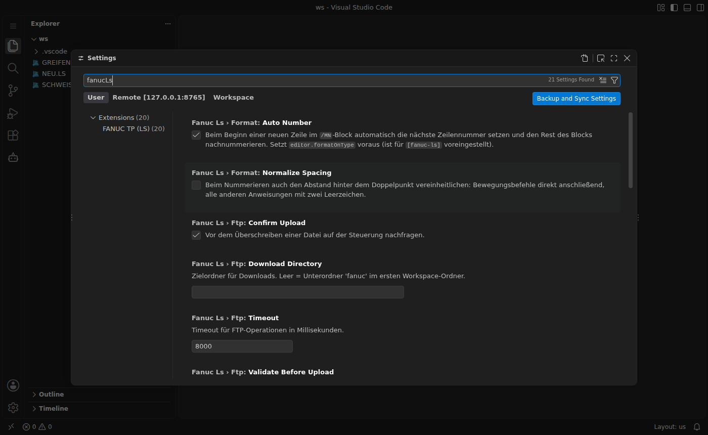

# Einstellungen

Öffnen über **Datei → Einstellungen → Einstellungen** (`Strg+,`) und nach `fanucLs` filtern:



## FTP

| Einstellung | Standard | Bedeutung |
|---|---|---|
| `fanucLs.controllers` | `[]` | Liste der Steuerungen (Name, Host, Port, Benutzer, FTPS, Geräte) |
| `fanucLs.ftp.timeout` | `8000` | Timeout für FTP-Operationen in ms |
| `fanucLs.ftp.verbose` | `false` | FTP-Protokoll in den Ausgabekanal *FANUC FTP* schreiben |
| `fanucLs.ftp.downloadDirectory` | `""` | Zielordner für Downloads; leer = Unterordner `fanuc` im Workspace |
| `fanucLs.ftp.confirmUpload` | `true` | vor dem Überschreiben auf der Steuerung nachfragen |
| `fanucLs.ftp.validateBeforeUpload` | `true` | vor dem Upload die Syntaxprüfung ausführen |

## Formatierung

| Einstellung | Standard | Bedeutung |
|---|---|---|
| `fanucLs.format.autoNumber` | `true` | Zeilennummer beim Zeilenumbruch im `/MN`-Block automatisch setzen |
| `fanucLs.format.normalizeSpacing` | `false` | Abstand hinter dem Doppelpunkt vereinheitlichen |

## Syntaxprüfung

| Einstellung | Standard | Bedeutung |
|---|---|---|
| `fanucLs.validation.enable` | `true` | Prüfung insgesamt ein/aus |
| `fanucLs.validation.run` | `onType` | `onType` (beim Tippen) oder `onSave` |
| `fanucLs.validation.checkLineNumbers` | `true` | fortlaufende Zeilennummern |
| `fanucLs.validation.checkLineCount` | `true` | `LINE_COUNT` gegen tatsächliche Zeilenzahl |
| `fanucLs.validation.checkPositions` | `true` | verwendete `P[n]` gegen `/POS` |
| `fanucLs.validation.reportUnusedPositions` | `true` | unbenutzte Positionen melden |
| `fanucLs.validation.checkLabels` | `true` | `LBL[n]` undefiniert/doppelt/unbenutzt |
| `fanucLs.validation.checkMotion` | `true` | Geschwindigkeitseinheit, Überschleifen |
| `fanucLs.validation.checkProgramName` | `true` | Programmname gegen Dateinamen |
| `fanucLs.validation.checkCallTargets` | `true` | `CALL`-Ziele im Workspace suchen |
| `fanucLs.validation.checkLineFormat` | `false` | strenges Zeilenformat |
| `fanucLs.validation.maxLinearSpeed` | `2000` | Warnschwelle Bahngeschwindigkeit in mm/sec |
| `fanucLs.validation.limits` | siehe unten | Obergrenzen je Registertyp; `0` = keine Prüfung |

Standard-Obergrenzen: `R 200`, `PR 100`, `DI/DO 512`, `RI/RO 8`, `GI/GO 10`, `AI/AO 64`, `SI/SO 16`, `UI 18`, `UO 20`, `F 1024`, `M 500`, `TIMER 10`, `AR 10`, `SR 100`, `UTOOL 10`, `UFRAME 10`, `PAYLOAD 10`, `P` ohne Prüfung.

## Editor-Voreinstellungen für `.ls`

Die Extension setzt für die Sprache `fanuc-ls` folgende Voreinstellungen, die sich in den eigenen Einstellungen überschreiben lassen:

```jsonc
"[fanuc-ls]": {
  "editor.insertSpaces": true,
  "editor.tabSize": 4,
  "editor.wordWrap": "off",
  "files.eol": "\r\n",                  // LS-Dateien verwenden CRLF
  "files.trimTrailingWhitespace": false, // Leerzeichen vor ";" gehören zum Format
  "editor.formatOnType": true,          // nötig für automatische Zeilennummern
  "editor.formatOnSave": false
}
```
