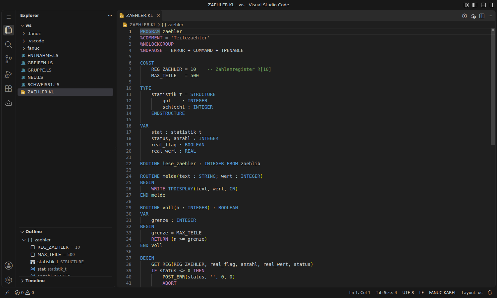

# KAREL

Neben TP-Programmen (`.ls`) unterstützt die Extension auch **KAREL-Quelltexte** (`.kl`). Dateien ohne Endung werden erkannt, wenn die erste Zeile mit `PROGRAM` beginnt. Unten rechts steht dann **FANUC KAREL**.

## Funktionen

- **Syntaxhighlighting:**
  - Schlüsselwörter, Datentypen (`INTEGER`, `REAL`, `STRING`, `XYZWPR`, `JOINTPOS`, …) und Direktiven (`%COMMENT`, `%NOLOCKGROUP`, `%INCLUDE`, …)
  - Systemvariablen (`$…`) und E/A-Arrays (`DIN[ ]`, `DOUT[ ]`, `GIN[ ]`, …)
  - wichtige Built-ins (`GET_REG`, `SET_INT_REG`, `GET_POS_REG`, `POST_ERR`, `CNV_INT_STR`, …) sowie Kommentare `--` und Zeichenketten `'…'`
- **Outline:** Programm mit Konstanten, Typen, Variablen und Routinen (inkl. Parameter und Rückgabetyp); externe Routinen (`FROM …`) werden gesondert angezeigt.
- **Einrückung und Faltung** für `BEGIN`/`END`, `IF`/`ENDIF`, `FOR`/`ENDFOR`, `WHILE`/`ENDWHILE`, `REPEAT`/`UNTIL`, `SELECT`/`ENDSELECT`, `CONDITION`/`ENDCONDITION`, `STRUCTURE`/`ENDSTRUCTURE`.
- **Snippets:**

| Kürzel | Ergebnis |
|---|---|
| `program` | Programmgerüst mit Direktiven, `CONST`, `VAR`, `BEGIN`/`END` |
| `routine` / `function` / `routinefrom` | Prozedur, Funktion mit Rückgabewert, externe Routine |
| `if` `ifelse` `for` `while` `repeat` `select` | Kontrollstrukturen |
| `condition` | Condition Handler mit `WHEN … DO` und `ENABLE` |
| `structure` | Strukturtyp |
| `write` `read` | Ausgabe/Eingabe am Teach Pendant |
| `getreg` `setreg` `getposreg` `setposreg` | Zahlen- und Positionsregister |
| `dout` `waitdin` `delay` | E/A und Warten |
| `posterr` `chkstatus` | Fehlermeldung, Statusprüfung |
| `include` | `%INCLUDE` |

- **Übertragen:** `.kl`-Quellen und übersetzte `.pc`-Programme lassen sich wie alle Dateien über die [[Controller-Ansicht|Controller-und-FTP]] hoch- und herunterladen. Auf der Steuerung läuft nur die übersetzte `.pc`-Datei.

## Kompilieren mit ktrans

Übersetzt wird mit `ktrans.exe`. Das Programm gehört zu **ROBOGUIDE** und läuft nur unter Windows.

1. In den Einstellungen `fanucLs.karel.ktransPath` auf `ktrans.exe` setzen, z. B. `C:\Program Files (x86)\FANUC\WinOLPC\bin\ktrans.exe`.
2. Optional `fanucLs.karel.ktransArgs`, z. B. `/ver V9.30-1` für die Softwareversion der Steuerung.
3. In der `.kl`-Datei auf das Zahnrad in der Editor-Titelleiste klicken (**FANUC: KAREL kompilieren**). Die Übersetzung läuft im Terminal *FANUC KAREL*, die `.pc`-Datei entsteht neben der Quelle.

Die Syntax wird bisher nur durch ktrans geprüft; eine eigene KAREL-Syntaxprüfung wie bei TP-Programmen gibt es noch nicht.
