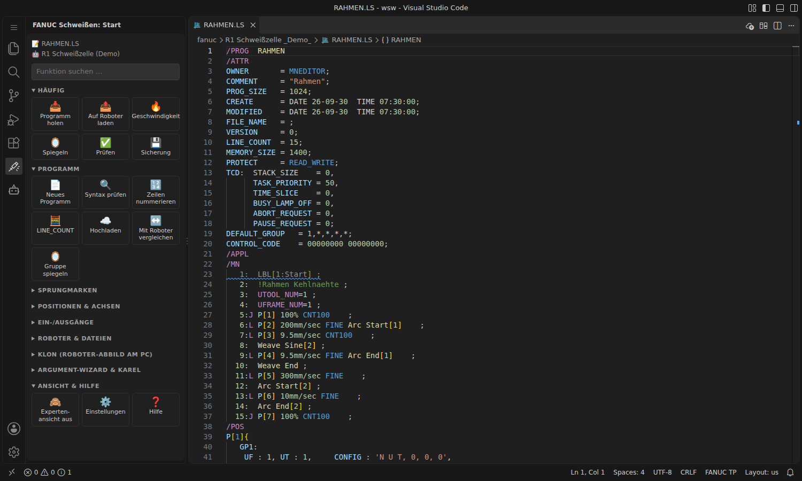
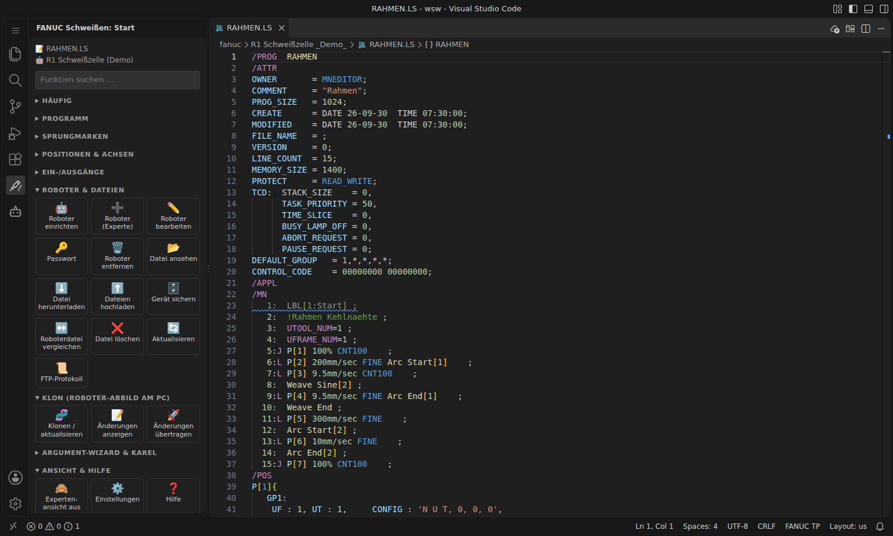
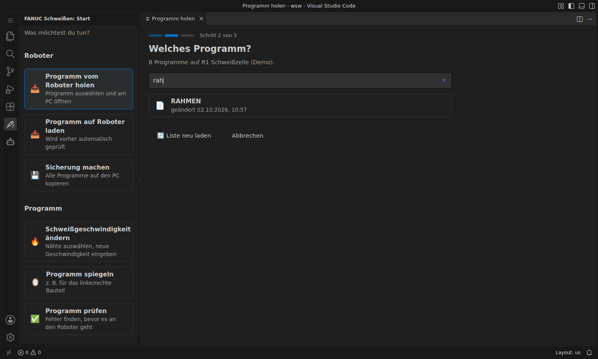
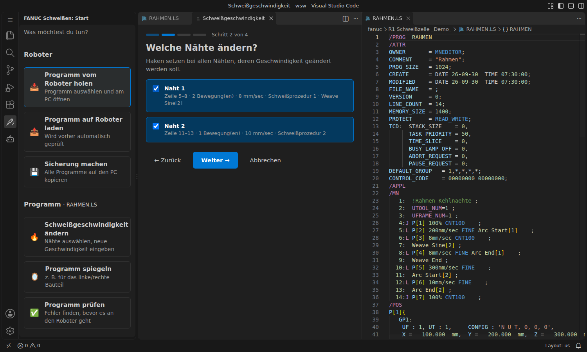
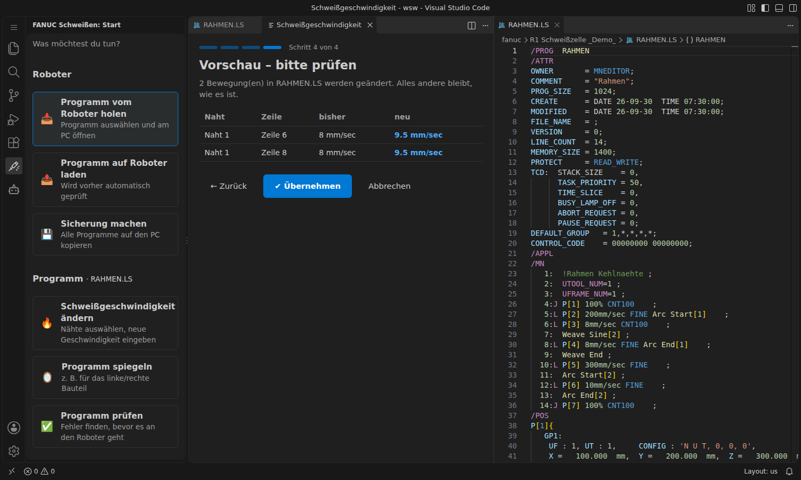
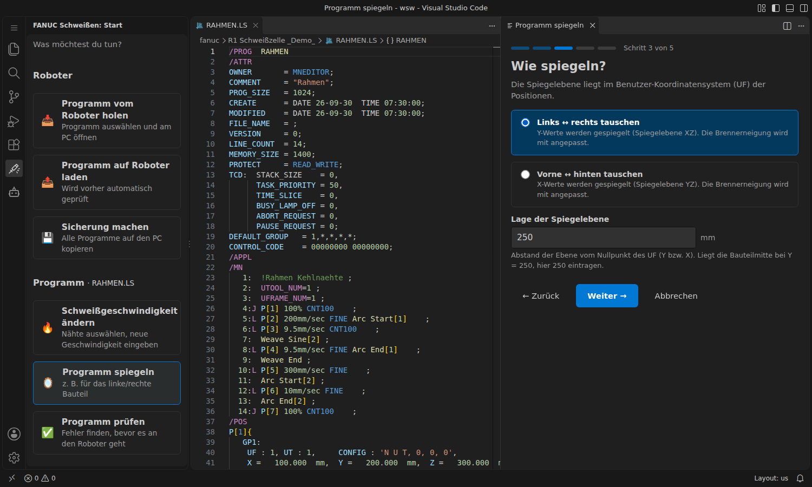
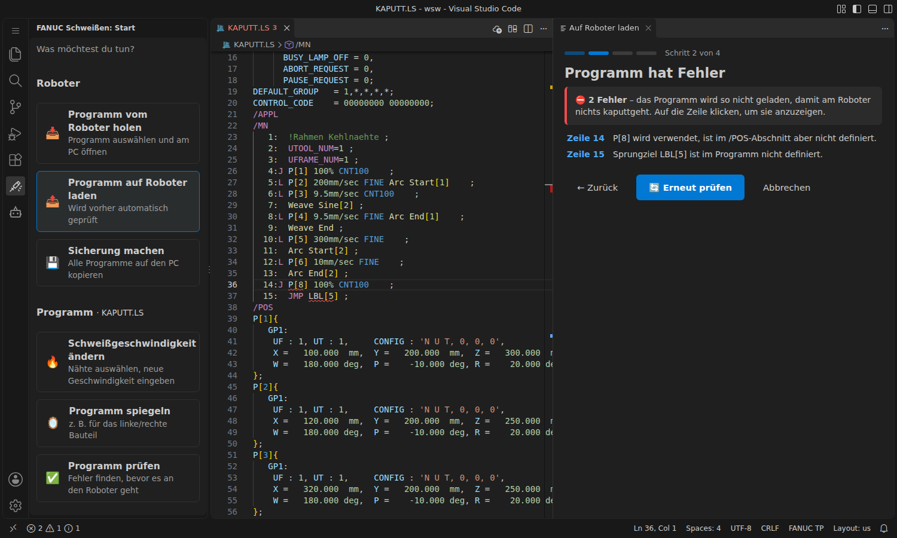
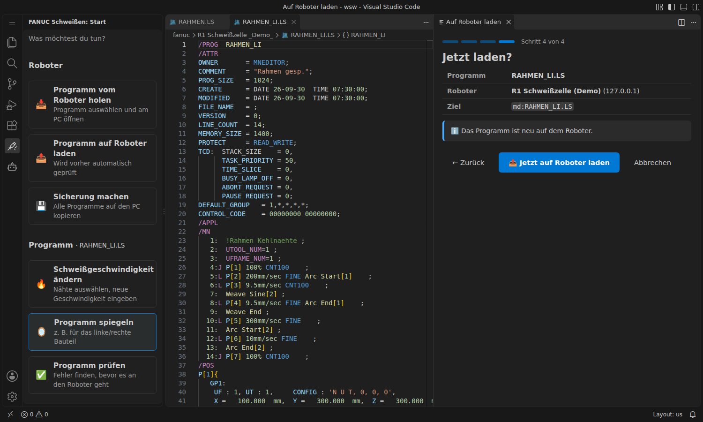
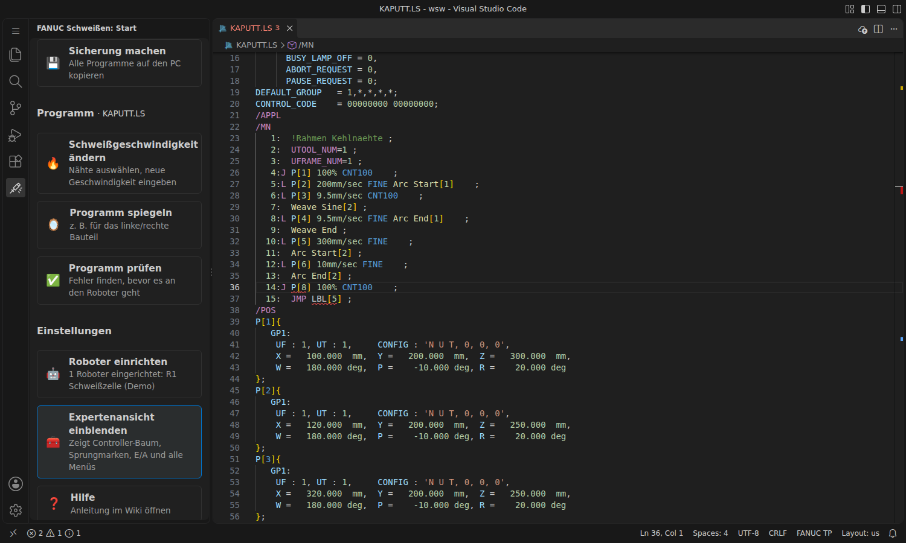

# Schweißer-Oberfläche

Für Anwender ohne Programmiererfahrung hat die Extension einen eigenen Seitenreiter: **FANUC Schweißen** (Symbol mit Schweißbrenner links in der Aktivitätsleiste). Dort ist **jede Funktion der Extension** als Kachel erreichbar. Die häufigsten Aufgaben laufen über Assistenten, die Schritt für Schritt durchführen. Befehlspalette, Kontextmenüs und der Programmcode werden dafür nicht gebraucht.

## Aufbau der Startseite

- **Oben** stehen das zuletzt bearbeitete Programm (📝) und die eingerichteten Roboter (🤖).
- **Funktion suchen …** filtert die Kacheln nach Name und Beschreibung, z. B. „sicher“ findet *Sicherung* und *Gerät sichern*.
- Die Kacheln sind in **aufklappbare Bereiche** gegliedert. Welche Bereiche offen sind, merkt sich die Seite.
- **Mit der Maus über einer Kachel** erscheint eine kurze Erklärung.
- Kacheln, die ein Programm brauchen (z. B. *Sprungmarke einfügen*), arbeiten mit dem **zuletzt bearbeiteten Programm** und holen es dafür nach vorne. Ist noch keins offen, bietet die Seite *Programm vom Roboter holen* oder *Datei öffnen* an.
- Funktionen, die sonst einen Eintrag im Controller-Baum brauchen (*Datei ansehen*, *Datei löschen*, *Gerät sichern* …), fragen Roboter, Gerät und Datei nacheinander in Auswahllisten ab.

| Bereich | Kacheln |
|---|---|
| Häufig | Programm holen, Auf Roboter laden, Geschwindigkeit, Spiegeln, Prüfen, Sicherung (Assistenten) |
| Programm | Neues Programm, Syntax prüfen, Zeilen nummerieren, LINE_COUNT, Hochladen, Mit Roboter vergleichen, Gruppe spiegeln |
| Sprungmarken | Einfügen, Alle neu nummerieren, Kommentar ändern, Nummer ändern |
| Positionen & Achsen | Position anlegen, Gruppe hinzufügen/entfernen, Zusatzachse hinzufügen/entfernen |
| Ein-/Ausgänge | Vom Roboter importieren, CSV importieren/exportieren, Gültige Bereiche, Status ein/aus, Status entfernen, Neu laden |
| Roboter & Dateien | Roboter einrichten/bearbeiten/entfernen, Passwort, Datei ansehen/herunterladen/hochladen/löschen, Gerät sichern, Roboterdatei vergleichen, Aktualisieren, FTP-Protokoll |
| Klon | Klonen/aktualisieren, Änderungen anzeigen, Änderungen übertragen |
| Argument-Wizard & KAREL | Neue ARGDISP-Datei, Argumente beschreiben, KAREL kompilieren |
| Ansicht & Hilfe | Expertenansicht ein/aus, Einstellungen, Hilfe |

## Assistenten

| Kachel | Was passiert |
|---|---|
| **Programm vom Roboter holen** | Roboter wählen → Programm aus der Liste suchen und anklicken → das Programm öffnet sich. Gespeichert wird es unter `fanuc/<Robotername>/`. Gibt es am PC schon eine Kopie, fragt der Assistent, ob sie ersetzt werden soll. |
| **Programm auf Roboter laden** | Das Programm wird automatisch geprüft. **Bei Fehlern wird es nicht geladen.** Danach Roboter wählen (vorgeschlagen wird der Roboter, von dem das Programm stammt) und bestätigen. Der Assistent warnt, wenn das Programm auf dem Roboter ersetzt wird. |
| **Sicherung machen** | Kopiert alle Dateien eines Roboters (Standard: `md:`) auf den PC nach `fanuc/Sicherungen/<Roboter>/<Datum_Uhrzeit>/`. Am Roboter wird nichts verändert. |
| **Schweißgeschwindigkeit ändern** | Zeigt alle Nähte (`Arc Start` … `Arc End`) mit ihrer aktuellen Geschwindigkeit. Nähte ankreuzen → neuen Wert eingeben oder um Prozent ändern → Vorschau → übernehmen. |
| **Programm spiegeln** | Spiegelt eine Bewegungsgruppe, z. B. für das linke/rechte Bauteil. Ergebnis als neues Programm (empfohlen) oder direkt im Programm. |
| **Programm prüfen** | Zeigt eine Übersicht (Zeilen, Nähte, Positionen) und alle Fehler in verständlicher Form. Ein Klick auf „Zeile 14“ springt zur Stelle im Programm. |
| **Roboter einrichten** | Name und IP-Adresse eintragen, optional ein Passwort. Die Verbindung wird sofort getestet. |

Nach jedem Assistenten schlägt die Abschlussseite die sinnvollen nächsten Schritte vor, z. B. nach dem Holen: *Geschwindigkeit ändern*, *Spiegeln*, *Prüfen*, *Auf Roboter laden*.

## Schweißgeschwindigkeit ändern

(Kachel *Geschwindigkeit*)

- Eine Naht beginnt bei `Arc Start[…]` (bzw. `Weld Start[…]`) und endet bei `Arc End[…]`. Steht `Arc Start` hinter einer Bewegung (`L P[2] 200mm/sec FINE Arc Start[1]`), gehört diese Anfahrt **nicht** zur Naht. Steht `Arc End` hinter einer Bewegung, gehört diese Bewegung zur Naht.
- Geändert werden nur Bahnbewegungen innerhalb der Naht mit fester Geschwindigkeit (`mm/sec`, `cm/min`, `inch/min`). Anfahrten, Gelenkbewegungen und Geschwindigkeiten aus Registern oder `WELD_SPEED` bleiben unverändert. Der Assistent weist darauf hin.
- **Fester Wert** setzt alle gewählten Nähte auf dieselbe Geschwindigkeit. **Prozent** ändert jede Bewegung im gleichen Verhältnis, z. B. `+10` oder `-5`.
- Die Vorschau zeigt jede betroffene Zeile mit altem und neuem Wert. Liegt der neue Wert außerhalb von ca. 1–40 mm/sec, erscheint eine Warnung.

Nach dem Übernehmen wird das Programm gespeichert. Rückgängig machen: im Programmfenster **Strg+Z** und erneut speichern.

## Programm spiegeln

1. Programm wählen.
2. Bei mehreren Bewegungsgruppen die Gruppe wählen. **Nur diese Gruppe wird gespiegelt**, alle anderen (Positionierer, Lineareinheit …) bleiben unverändert.
3. *Links ↔ rechts tauschen* (Y wird gespiegelt) oder *Vorne ↔ hinten tauschen* (X wird gespiegelt) und die Lage der Spiegelebene in mm eingeben, z. B. die Bauteilmitte. Bei Achswerten oder Zusatzachsen werden die Achsen und ihre Mittelwerte abgefragt.
4. Ziel: neues Programm (Name, Standard `<NAME>_M`) oder direkt im Programm.
5. Die Vorschau zeigt, wie viele Positionen gespiegelt werden, und welche Stellen von Hand geprüft werden müssen (z. B. Positionsregister, CONFIG).

Die Rechenregeln stehen unter [[Bewegungsgruppen und externe Achsen]].

## Schutz vor fehlerhaften Programmen

Der Assistent *Auf Roboter laden* lädt kein Programm hoch, das Fehler hat. Er zeigt die Fehler mit Zeilennummer; ein Klick springt zur Stelle. Nach der Korrektur auf **Erneut prüfen** klicken. Hinweise (gelb) blockieren nicht.

Vor dem Laden zeigt der Assistent noch einmal Programm, Roboter und Ziel an und warnt, wenn ein vorhandenes Programm ersetzt wird:

> Gespiegelte oder geänderte Programme immer zuerst im Handbetrieb (T1) mit reduzierter Geschwindigkeit abfahren.

## Einfacher Modus

Über die Kachel **Expertenansicht ausblenden** (oder die Einstellung `fanucLs.simpleMode`) werden ausgeblendet:

- der Experten-Seitenreiter **FANUC** (Controller-Baum, Sprungmarken, E/A)
- alle FANUC-Einträge in den Kontextmenüs des Editors und Explorers

Übrig bleiben der Seitenreiter *FANUC Schweißen* und in der Titelleiste eines Programms der Knopf **Programm auf Roboter laden**. Syntaxhighlighting und die rote Unterstreichung von Fehlern bleiben aktiv. Mit **Expertenansicht einblenden** ist alles wieder da.

Tipp für die Einrichtung im Betrieb: Ein Programmierer richtet die Roboter einmal ein und schaltet danach den einfachen Modus ein.

## Befehle

Die Assistenten sind auch über die Befehlspalette (`F1`) unter **FANUC Schweißen** erreichbar:

| Befehl | ID |
|---|---|
| Programm vom Roboter holen | `fanucLs.welder.download` |
| Programm auf Roboter laden | `fanucLs.welder.upload` |
| Sicherung vom Roboter machen | `fanucLs.welder.backup` |
| Schweißgeschwindigkeit ändern | `fanucLs.welder.speed` |
| Programm spiegeln (Assistent) | `fanucLs.welder.mirror` |
| Programm prüfen (Assistent) | `fanucLs.welder.check` |
| Roboter einrichten | `fanucLs.welder.setup` |
