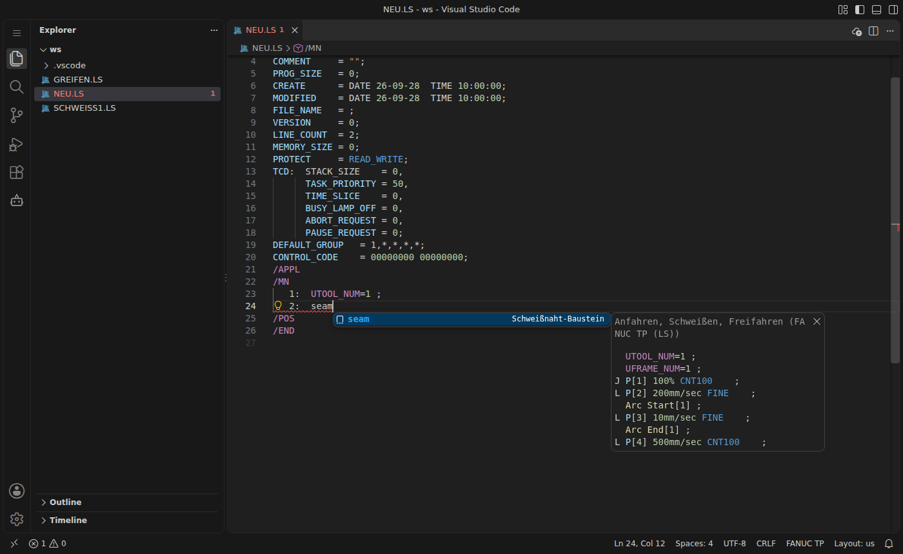
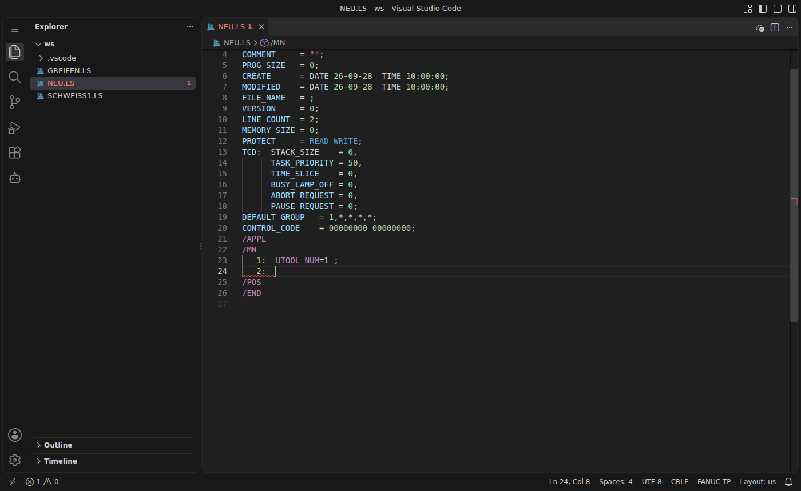

# Snippets und Zeilennummern

## Snippets

Kürzel eintippen und mit `Tab` bzw. `Enter` übernehmen. Falls die Vorschlagsliste nicht von selbst erscheint, hilft `Strg+Leertaste`. Rechts wird eine Vorschau des eingefügten Codes angezeigt:

Innerhalb eines Snippets springt `Tab` von Platzhalter zu Platzhalter. Bei Auswahllisten (z. B. `FINE`/`CNT`) erscheint ein Menü.

| Kürzel | Ergebnis |
|---|---|
| `prog` | komplettes LS-Gerüst mit ATTR-Block und aktuellem Zeitstempel |
| `pos` / `posj` | Positionsdatensatz kartesisch bzw. in Achswerten |
| `j` `l` `c` `a` | Bewegungsbefehle mit Auswahl FINE/CNT |
| `lpr` `loffset` `lskip` `ltb` | Bewegung mit Positionsregister, Offset, Skip-Bedingung, Time-Before |
| `rem` | Bemerkung `!…` |
| `if` `ifblock` `ifelse` `select` `for` | Verzweigungen und Schleifen |
| `lbl` `lbln` `jmp` `call` `callarg` `end` | Sprungmarken und Programmaufrufe |
| `waittime` `waitdi` `waitto` | Warteanweisungen inkl. Timeout-Sprung |
| `do` `pulse` `go` `r` `pr` `prel` | E/A und Register |
| `utool` `uframe` `payload` `ovr` | Werkzeug, Koordinatensystem, Nutzlast, Override |
| `msg` `ualm` `timer` `pause` `col` | Meldungen, Alarme, Timer, Pause, Kollisionserkennung |
| `arcstart` `arcend` `weldstart` `weldend` `weave` | Schweiß- und Pendelbefehle |
| `seam` | kompletter Baustein Anfahren → Schweißen → Freifahren |
| `sysvar` | Zuweisung an eine Systemvariable |

## Automatische Zeilennummern

Beim Zeilenumbruch im `/MN`-Block setzt die Extension die nächste Nummer und nummeriert alles darunter nach. `LINE_COUNT` wird mit angepasst:

- **Dokument formatieren** (`Umschalt+Alt+F`) nummeriert den ganzen Block durch. So bekommen auch mehrzeilige Snippets wie `ifblock` oder `seam` ihre Nummern, die ohne Nummern eingefügt werden.
- **Beim Speichern:** in den Einstellungen für `[fanuc-ls]` `"editor.formatOnSave": true` setzen.
- **Befehl** `FANUC: Zeilennummern neu nummerieren` macht dasselbe und aktualisiert zusätzlich `MODIFIED`.

Dabei gelten zwei Regeln:
- **Fortsetzungszeilen** (z. B. der zweite Punkt einer Kreisbewegung, wenn die vorige Anweisung noch kein `;` hat) bleiben unnummeriert.
- **Abstand hinter dem Doppelpunkt:** Bewegungsbefehle stehen direkt dahinter (`   7:L P[2] …`), alle anderen Anweisungen mit zwei Leerzeichen (`   8:  DO[1]=ON ;`). Bei bestehenden Zeilen wird das nur mit `fanucLs.format.normalizeSpacing` vereinheitlicht.

Abschalten über `fanucLs.format.autoNumber`.
