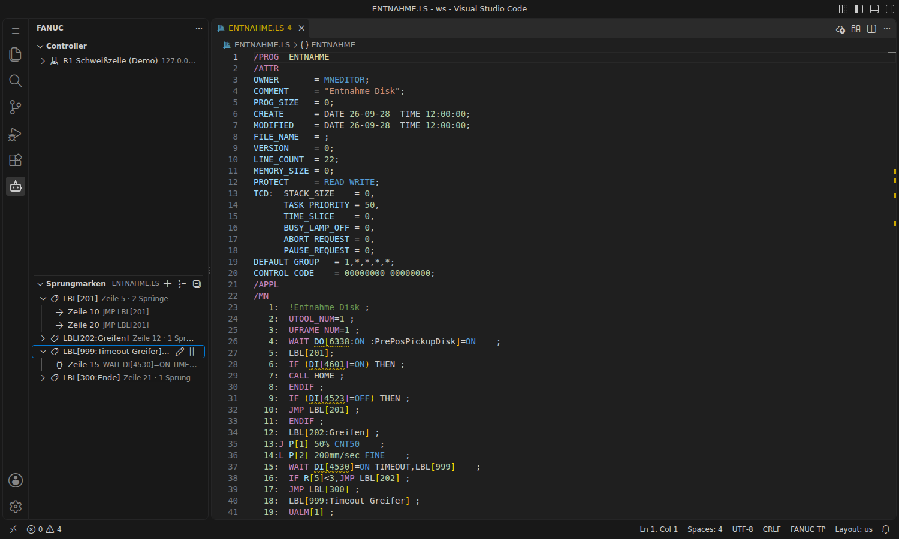

# Sprungmarken (LBL)

Für die Arbeit mit Sprungmarken gibt es eine eigene Ansicht und mehrere Editor-Funktionen. Damit behält man auch in langen Programmen mit vielen `JMP LBL[…]` den Überblick.

## Ansicht „Sprungmarken“

In der FANUC-Seitenleiste (Roboter-Symbol) unter **Sprungmarken**. Sie zeigt immer die Labels der aktiven `.ls`-Datei:

- jedes Label mit Kommentar, Zeile und Anzahl der Sprünge; aufgeklappt alle Stellen, die dorthin springen (`JMP`, `TIMEOUT,LBL`, `Skip,LBL`)
- **gelb**: Label wird nie angesprungen oder ist mehrfach definiert
- **rot**: Sprungziel ist nicht definiert
- Klick springt an die Stelle im Programm

| Aktion | Wo | Wirkung |
|---|---|---|
| Sprungmarke einfügen | **+** in der Ansicht, Rechtsklick im Editor | fügt unter der Cursorzeile `LBL[n:Kommentar]` mit der nächsten freien Nummer ein und nummeriert die Zeilen nach |
| Alle neu nummerieren | Listen-Symbol in der Ansicht | vergibt die Nummern in Reihenfolge des Auftretens neu (1, 2, 3 … oder 10, 20, 30 … oder 100, 110 …); alle Sprünge ziehen mit |
| Kommentar bearbeiten | Stift-Symbol am Label | setzt oder entfernt den Kommentar in `LBL[n:Kommentar]` |
| Nummer ändern | `#`-Symbol am Label | ändert die Nummer der Marke und aller Sprünge dorthin; belegte Nummern werden abgelehnt |

## Im Editor

| Funktion | Taste | Wirkung |
|---|---|---|
| Gehe zu Definition | `F12` / `Strg`+Klick auf `LBL[n]` | springt zur Marke |
| Alle Verweise | `Umschalt+F12` | listet alle Sprünge auf die Marke |
| Umbenennen | `F2` auf der Nummer | neue Nummer für Marke und alle Sprünge |
| Hover | Maus über `LBL[n]` | Kommentar, Definitionszeile bzw. Liste der Sprünge |
| Hervorhebung | Cursor auf `LBL[n]` | markiert Definition und alle Sprünge |
| Vervollständigung | nach `JMP LBL[` | schlägt die definierten Marken mit Kommentar vor; bei einer neuen Marke die nächste freie Nummer |

Sprünge in Bemerkungen (`!…`), Zeichenketten und Meldungstexten (`MESSAGE[…]`) werden nicht mitgezählt.
