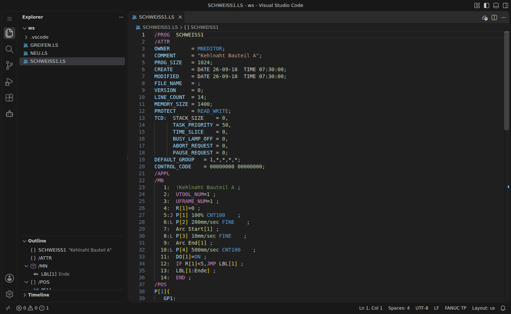

# Syntaxhighlighting und Outline

Sobald eine Datei mit der Endung `.ls` / `.LS` geöffnet wird, schaltet VS Code auf die Sprache **FANUC TP** um. Das ist unten rechts in der Statusleiste zu sehen. Dateien ohne passende Endung werden erkannt, wenn die erste Zeile mit `/PROG` beginnt.

## Was eingefärbt wird

| Element | Beispiel |
|---|---|
| Abschnitte | `/PROG` `/ATTR` `/APPL` `/MN` `/POS` `/END` |
| Programmname | `/PROG  SCHWEISS1` |
| Zeilennummern | `   5:` |
| Bewegungsart | `J` `L` `C` `A` |
| Geschwindigkeit + Einheit | `100%`, `200mm/sec`, `2sec` |
| Überschleifen | `FINE`, `CNT100`, `CD` |
| Bewegungsoptionen | `ACC80`, `Offset,PR[1]`, `Skip,LBL[2]`, `TB`, `PTH`, `Wjnt` |
| Schweißbefehle | `Arc Start[1]`, `Weld End`, `Weave Sine` |
| E/A | `DI` `DO` `RI` `RO` `GI` `GO` `AI` `AO` `UI` `UO` `F` `M` |
| Register | `R[1]`, `PR[5]`, `AR[1]`, `SR[2]`, `TIMER[1]` |
| Positionen / Labels | `P[3]`, `LBL[1:Ende]` |
| Systemvariablen | `$GROUP[1].$SPEEDLIM` |
| Bemerkungen | `!Kehlnaht Bauteil A` |

Der `/POS`-Block hat einen eigenen Kontext. Dort werden `P` und `R` als Koordinatenkomponenten (Pitch, Roll) eingefärbt und nicht als Position oder Register.

## Outline, Breadcrumbs, Faltung

- Die **Outline**-Ansicht (Explorer, unten) zeigt das Programm → Abschnitte → Labels und Positionen. Ein Klick springt an die Stelle.
- Die **Breadcrumbs** über dem Editor zeigen, in welchem Abschnitt der Cursor steht.
- Abschnitte lassen sich über die Pfeile am Rand **einklappen**.
- Die Einrückung folgt `IF … THEN` / `ENDIF` und `FOR` / `ENDFOR`.
