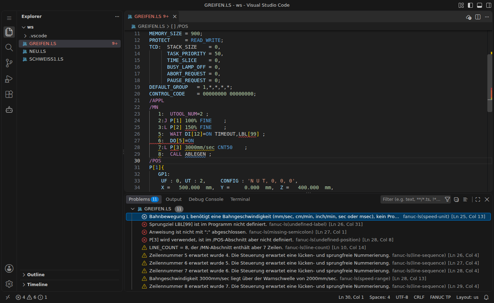
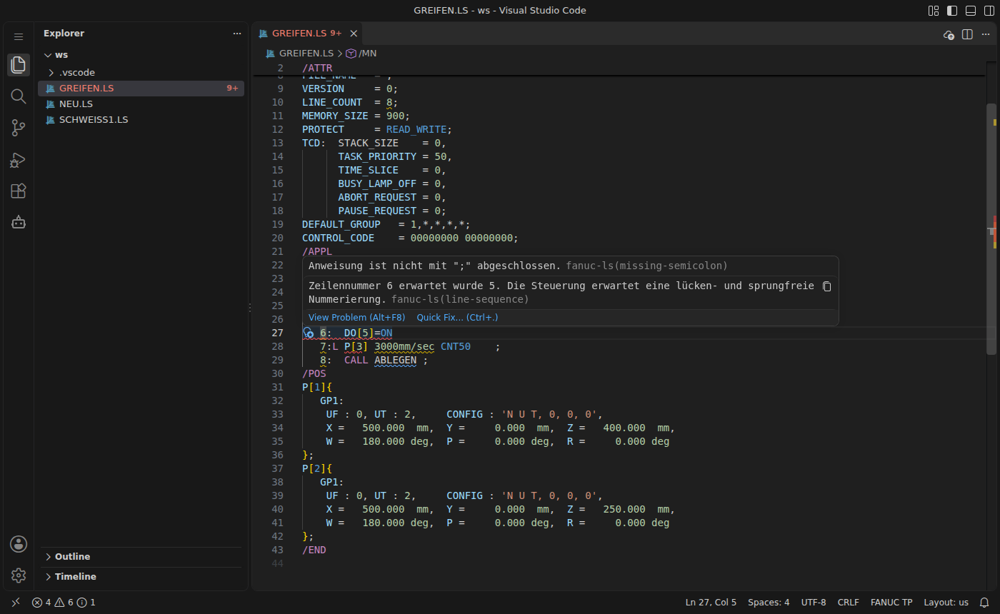
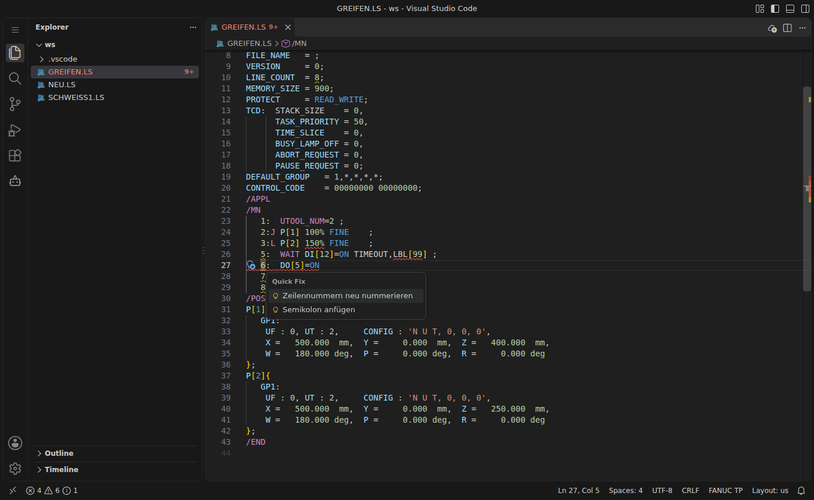

# Syntaxprüfung

Die Prüfung läuft beim Tippen oder beim Speichern, einstellbar über `fanucLs.validation.run`. Fehler erscheinen als Wellenlinie im Editor, in der Scrollleiste und in der Ansicht **Probleme** (`Strg+Umschalt+M`).



Beim Überfahren mit der Maus erscheint die Meldung als Hover, darunter ein Link zum Quick Fix:



## Prüfregeln

**Struktur**
- fehlende Abschnitte `/PROG`, `/ATTR`, `/MN`, `/END`
- Programmname vorhanden, gültige Zeichen, maximal 36 Zeichen
- Programmname im Header gegen den Dateinamen *(abschaltbar: `checkProgramName`)*
- `LINE_COUNT` gegen die tatsächliche Zeilenzahl *(`checkLineCount`)*

**Zeilen**
- lückenlos fortlaufende Nummerierung im `/MN`-Block *(`checkLineNumbers`)*
- fehlendes `;` am Zeilenende
- unausgeglichene Klammern
- optional: strenges Zeilenformat *(`checkLineFormat`, standardmäßig aus)*

**Bewegungsbefehle** *(`checkMotion`)*
- `J` mit anderer Einheit als `%`, Bahnbewegung (`L`, `C`, `A`) mit `%`
- Achsgeschwindigkeit über 100 %
- Bahngeschwindigkeit über der Warnschwelle `maxLinearSpeed` (Standard 2000 mm/sec)
- fehlende Überschleifart, `CNT` größer 100

**Referenzen**
- `P[n]` verwendet, aber nicht im `/POS`-Block definiert; doppelt definiert; nie verwendet (ausgegraut) *(`checkPositions`, `reportUnusedPositions`)*
- `LBL[n]` undefiniert, doppelt oder nie angesprungen *(`checkLabels`)*
- `IF … THEN` ohne `ENDIF`, `FOR` ohne `ENDFOR`, `ELSE` ohne `IF`
- `CALL`/`RUN` auf ein Programm ohne passende Datei im Workspace. Das ist nur ein Hinweis, denn auf der Steuerung kann das Programm trotzdem existieren *(`checkCallTargets`)*
- Registerindizes über den Obergrenzen aus `fanucLs.validation.limits`, Index `0`
- `UTOOL_NUM` außerhalb 1–10, `UFRAME_NUM` außerhalb 0–10

Jede Regel lässt sich unter [[Einstellungen]] einzeln abschalten.

## Quick Fixes

Cursor auf die markierte Stelle setzen und `Strg+.` drücken (oder auf die Glühbirne klicken):



| Quick Fix | Wirkung |
|---|---|
| Zeilennummern neu nummerieren | nummeriert `/MN` durch, aktualisiert `LINE_COUNT` und `MODIFIED` |
| LINE_COUNT korrigieren | setzt `LINE_COUNT` auf die tatsächliche Zeilenzahl |
| Semikolon anfügen | ergänzt das fehlende `;` |

## Grenzwerte an die Steuerung anpassen

Die Obergrenzen je Registertyp stehen in `fanucLs.validation.limits`. Ein Wert `0` schaltet die Prüfung für diesen Typ ab. Beispiel für eine Zelle mit mehr E/A:

```jsonc
"fanucLs.validation.limits": {
  "R": 200, "PR": 100, "DI": 1024, "DO": 1024, "F": 1024
}
```

Nicht aufgeführte Typen behalten ihren Standardwert.
